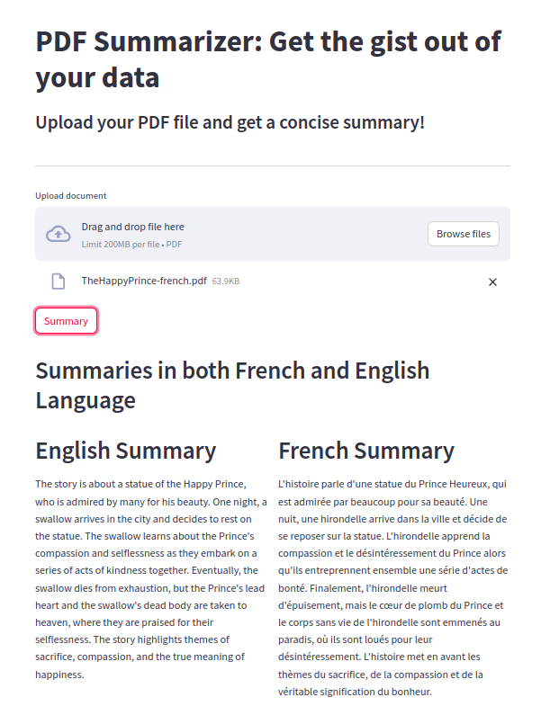

# PDF Summarizer

PDF Summarizer is a Streamlit app that allows users to upload PDF documents, detect their language, and generate concise summaries in both English and French.



## How to Use

1. Upload your PDF document using the file uploader.
2. Click the "Summary" button to generate summaries in both English and French languages.

## How to Run

To run the PDF Summarizer app locally, execute the following command:

```bash
streamlit run pdf_summarizer.py